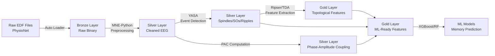

# Sleep EEG Lakehouse for Memory Consolidation Analysis

**A production-grade Databricks data engineering project covering all Databricks Certified Data Engineer Professional exam topics**

[](https://databricks.com)
[](https://azure.microsoft.com)
[](https://python.org)
[](https://delta.io)

## 🎓 Certification Alignment

This project is designed as a **2-week preparation guide** for the **Databricks Certified Data Engineer Professional** exam, covering all six exam domains:

| Exam Domain | Coverage | Project Component |
|-------------|----------|-------------------|
| **Databricks Tooling (20%)** | ✅ Complete | Unity Catalog, Workflows, CLI/API, Repos |
| **Data Processing (30%)** | ✅ Complete | Spark DataFrames, Structured Streaming, UDFs, Broadcast Joins |
| **Data Modeling (20%)** | ✅ Complete | Delta Lake, Partitioning, OPTIMIZE, ZORDER, Schema Evolution |
| **Security & Governance (10%)** | ✅ Complete | Unity Catalog, Row-Level Security, Data Lineage |
| **Monitoring & Logging (10%)** | ✅ Complete | DLT Expectations, Event Logs, Spark UI, Alerts |
| **Testing & Deployment (10%)** | ✅ Complete | pytest, Databricks Asset Bundles, CI/CD |

## 🧠 Scientific Context

### Research Background

This project implements the data engineering infrastructure for computational neuroscience research on **sleep-dependent memory consolidation**. It is based on:

- **Research Proposal:** "Persistent Homology Reveals Topological Dynamics of Sleep EEG Networks During Memory Consolidation" (Wang, 2026)
- **Key Paper:** Ngo et al. (2020), *eLife* - "Sleep spindles mediate hippocampal-neocortical coupling during long-duration ripples" ([DOI: 10.7554/eLife.57011](https://doi.org/10.7554/eLife.57011))
- **Dataset:** Sleep-EDF Expanded (N≈197 subjects, PhysioNet) ([Link](https://physionet.org/content/sleep-edfx/1.0.0/))

### Scientific Objectives

1. Characterize topological network dynamics during sleep using **Topological Data Analysis (TDA)** and persistent homology
2. Detect sleep oscillations (spindles, slow oscillations, ripples) and compute **phase-amplitude coupling (PAC)**
3. Extract novel **topological biomarkers** (Betti numbers, persistence landscapes) for memory consolidation
4. Build ML models to predict memory proxies (spindle density, PAC strength) from topological features

### Key References

- **Fernandez-Sanjurjo et al. (2026).** Sleep strengthens successor representations. *PLOS Biology.* [DOI: 10.1371/journal.pbio.3003740](https://doi.org/10.1371/journal.pbio.3003740)
- **Kang et al. (2024).** High-order brain network feature extraction via persistent homology (94.6% accuracy). *Frontiers in Human Neuroscience.* [DOI: 10.3389/fnhum.2024.1452197](https://doi.org/10.3389/fnhum.2024.1452197)
- **Vallat & Walker (2021).** YASA: An open-source tool for automated sleep staging. *eLife.* [DOI: 10.7554/eLife.70092](https://doi.org/10.7554/eLife.70092)
- **Bauer (2021).** Ripser: Efficient computation of Vietoris-Rips persistence barcodes. *J Appl Comput Topology.* [DOI: 10.1007/s41468-021-00071-5](https://doi.org/10.1007/s41468-021-00071-5)

---

## 🏗️ Architecture

### Medallion Architecture (Bronze → Silver → Gold)



### Technology Stack

- **Cloud Platform:** Azure Databricks (Unity Catalog, Delta Live Tables, Workflows)
- **Storage:** Azure Data Lake Storage (ADLS) Gen2 / Databricks Volumes
- **Processing:** Apache Spark (PySpark, Spark SQL), Delta Lake
- **Signal Processing:** MNE-Python, YASA (sleep staging, spindle/SO detection)
- **Topological Data Analysis:** Ripser, Giotto-TDA, Gudhi
- **Machine Learning:** scikit-learn, XGBoost, SHAP
- **CI/CD:** Databricks Asset Bundles, GitHub Actions
- **Testing:** pytest, Great Expectations

---

## 📁 Repository Structure

```
sleep-eeg-lakehouse-databricks/
├── README.md                          # This file
├── databricks.yml                     # Databricks Asset Bundle config
├── requirements.txt                   # Python dependencies
├── src/
│   ├── bronze/
│   │   ├── ingest_sleep_edf.py       # Bronze: Ingest raw EDF with Auto Loader
│   │   └── schema_sleep_edf.json     # Bronze: Expected schema
│   ├── silver/
│   │   ├── preprocess_eeg.py         # Silver: Filtering, ICA, artifacts
│   │   ├── detect_sleep_events.py    # Silver: Spindle/SO/ripple detection
│   │   └── compute_pac.py            # Silver: Phase-amplitude coupling
│   ├── gold/
│   │   ├── extract_tda_features.py   # Gold: Persistent homology
│   │   ├── aggregate_memory_proxies.py # Gold: Spindle density, PAC
│   │   └── create_ml_features.py     # Gold: ML-ready features
│   ├── utils/
│   │   ├── signal_processing.py      # Shared: Bandpass, notch, ICA
│   │   ├── tda_utils.py              # TDA: Vietoris-Rips, Betti curves
│   │   └── expectations.py           # Data quality expectations
│   └── dlt_pipeline.py               # Delta Live Tables pipeline
├── tests/
│   ├── test_signal_processing.py     # Unit tests: Signal processing
│   ├── test_tda_features.py          # Unit tests: TDA features
│   └── test_data_quality.py          # Integration tests: DLT
├── notebooks/
│   ├── 01_explore_sleep_edf.py       # Exploration: Load & visualize
│   ├── 02_validate_preprocessing.py  # Validation: Check signals
│   └── 03_analyze_tda_features.py    # Analysis: ML models
├── config/
│   ├── dev.yaml                      # Dev environment
│   ├── test.yaml                     # Test environment
│   └── prod.yaml                     # Prod environment
├── .github/
│   └── workflows/
│       ├── deploy.yml                # CI/CD: Deploy DABs
│       └── test.yml                  # CI/CD: Run pytest
└── data/
    └── README.md                     # Download instructions
```

---

## 🚀 Quick Start

### Prerequisites

1. **Databricks Workspace:** Azure Databricks workspace with Unity Catalog enabled
2. **Azure Storage:** ADLS Gen2 container for raw EDF files
3. **Python 3.10+** with pip
4. **Databricks CLI:** `pip install databricks-cli`

### Step 1: Download Sleep-EDF Dataset

```bash
# Download from PhysioNet (requires WFDB toolkit)
pip install wfdb
python data/download_sleep_edf.py --output ./data/raw --n-subjects 20

# Or download manually from:
# https://physionet.org/content/sleep-edfx/1.0.0/
```

### Step 2: Upload to Azure Storage

```bash
# Upload EDF files to ADLS Gen2
az storage blob upload-batch \
  --source ./data/raw \
  --destination sleep-edf-raw \
  --account-name <storage_account> \
  --account-key <key>
```

### Step 3: Set Up Unity Catalog

```sql
-- Run in Databricks SQL or notebook
CREATE CATALOG IF NOT EXISTS sleep_eeg_lakehouse;
USE CATALOG sleep_eeg_lakehouse;

CREATE SCHEMA IF NOT EXISTS bronze;
CREATE SCHEMA IF NOT EXISTS silver;
CREATE SCHEMA IF NOT EXISTS gold;

-- External location for raw files
CREATE EXTERNAL LOCATION IF NOT EXISTS sleep_edf_raw
URL 'abfss://sleep-edf-raw@<storage_account>.dfs.core.windows.net/'
WITH (STORAGE CREDENTIAL <credential_name>);
```

### Step 4: Install Dependencies

```bash
pip install -r requirements.txt
```

### Step 5: Deploy with Databricks Asset Bundles

```bash
# Configure Databricks CLI
databricks configure --token

# Deploy to dev environment
databricks bundle deploy --target dev

# Run DLT pipeline
databricks bundle run sleep_eeg_dlt_pipeline --target dev
```

### Step 6: Run Notebooks for Analysis

1. Import notebooks from `notebooks/` into Databricks workspace
2. Attach to a cluster with ML runtime (13.3 LTS ML or later)
3. Run notebooks sequentially: `01_explore` → `02_validate` → `03_analyze`

---

## 📚 2-Week Study Plan

### Week 1: Core Concepts (Days 1-7)

| Day | Topic | Study Hours | Hands-On |
|-----|-------|-------------|----------|
| 1-2 | Data Processing (Spark optimization, AQE, broadcast joins) | 3-4h | Profile queries in Spark UI |
| 3-4 | Data Modeling (Delta Lake internals, OPTIMIZE, ZORDER) | 3-4h | Implement time travel, partitioning |
| 5-6 | Databricks Tooling (Unity Catalog, CLI, Workflows) | 3-4h | Set up UC metastore, create workflows |
| 7 | **Practice Exam 1** + Review | 3-4h | Full-length exam (60Q, 120min) |

### Week 2: Advanced Topics + Project (Days 8-14)

| Day | Topic | Study Hours | Hands-On |
|-----|-------|-------------|----------|
| 8-9 | Testing & Deployment (DABs, CI/CD, pytest) | 3-4h | Create DAB, GitHub Actions workflow |
| 10-11 | Security, Governance, Monitoring (UC, DLT expectations) | 3-4h | Row-level security, event logs |
| 12-13 | **Practical Project** (Sleep EEG Pipeline) | 6-8h | Implement Bronze→Silver→Gold layers |
| 14 | **Practice Exam 2** + Final Review | 3-4h | Full-length exam + review weak areas |

### Study Resources

- **Official Docs:** [Databricks Documentation](https://docs.databricks.com/)
- **Delta Lake Guide:** [Delta Lake Docs](https://docs.delta.io/)
- **Practice Exams:** [ExamTopics](https://www.examtopics.com/exams/databricks/certified-data-engineer-professional/) (verify with official docs)
- **YouTube:** Search "Databricks Data Engineer Professional 2026"

---

## 🧪 Testing

### Run Unit Tests

```bash
# Run all tests
pytest tests/ -v

# Run specific test file
pytest tests/test_signal_processing.py -v

# Run with coverage
pytest tests/ --cov=src --cov-report=html
```

### Run Integration Tests

```bash
# Test DLT pipeline locally
databricks bundle validate

# Test deployment to dev
databricks bundle deploy --target dev --dry-run
```

---

## 📊 Data Quality & Monitoring

### DLT Expectations

All tables include data quality expectations:

```python
# Example: Bronze layer
@dlt.expect_or_drop("valid_subject_id", "subject_id IS NOT NULL")
@dlt.expect_or_drop("valid_file_type", "file_type IN ('PSG', 'Hypnogram')")

# Example: Silver layer
@dlt.expect_or_drop("valid_sampling_rate", "sampling_rate >= 100")
@dlt.expect_or_drop("sufficient_duration", "duration_sec >= 60")

# Example: Gold layer
@dlt.expect_or_drop("valid_pac", "pac_modulation_index >= 0")
```

### Monitor Pipeline Health

```python
# Query DLT event log
event_log = spark.read.format("delta").load("/pipelines/<pipeline_id>/system/events")

# Check expectation violations
violations = event_log.filter("details.flow_progress.status = 'FAILED'")
violations.select("timestamp", "details.flow_progress.data_quality_metrics").show()
```

---

## 🔒 Security & Governance

### Unity Catalog Features

- **Catalogs & Schemas:** 3-level namespace (`catalog.schema.table`)
- **External Locations:** Secure access to ADLS Gen2
- **Row-Level Security:** Dynamic views filter by user
- **Data Lineage:** Track data flows across pipeline

### Row-Level Security Example

```sql
CREATE OR REPLACE VIEW sleep_eeg_lakehouse.gold.gold_ml_features_secure AS
SELECT *
FROM sleep_eeg_lakehouse.gold.gold_ml_features
WHERE subject_id IN (
    SELECT subject_id 
    FROM sleep_eeg_lakehouse.governance.subject_access_control
    WHERE user_email = current_user()
);

GRANT SELECT ON VIEW gold_ml_features_secure TO `data_scientists`;
```

---

## 🤝 Contributing

Contributions are welcome! Please:

1. Fork the repository
2. Create a feature branch (`git checkout -b feature/amazing-feature`)
3. Add tests for new functionality
4. Ensure all tests pass (`pytest tests/ -v`)
5. Commit changes (`git commit -m 'Add amazing feature'`)
6. Push to branch (`git push origin feature/amazing-feature`)
7. Open a Pull Request

---

## 📄 License

MIT License - see [LICENSE](LICENSE) file for details.

---

## 📧 Contact

**Yuhao Wang**  
- GitHub: [@wang-yuhao](https://github.com/wang-yuhao)  
- LinkedIn: [Yuhao Wang](https://linkedin.com/in/yuhao-wang)  
- Email: contact@yuhao.de

---

## 🙏 Acknowledgments

- **PhysioNet:** For providing the Sleep-EDF Expanded dataset
- **Sleep Research Community:** For validated methods (YASA, MNE-Python)
- **TDA Community:** For computational topology tools (Ripser, Giotto-TDA)
- **Databricks Community:** For excellent documentation and learning resources

---

## 📖 Citation

If you use this project in your research, please cite:

```bibtex
@software{wang2026sleep,
  author = {Wang, Yuhao},
  title = {Sleep EEG Lakehouse for Memory Consolidation Analysis},
  year = {2026},
  url = {https://github.com/wang-yuhao/sleep-eeg-lakehouse-databricks}
}
```

---

**Good luck with your Databricks certification and research! 🎓🧠**